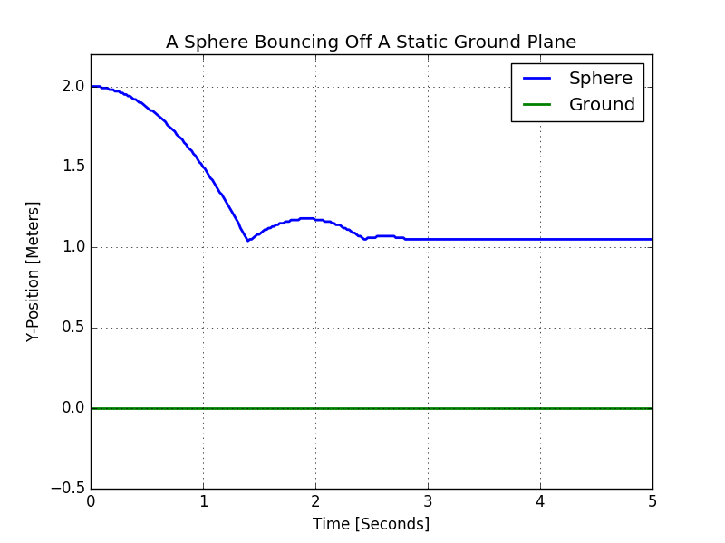
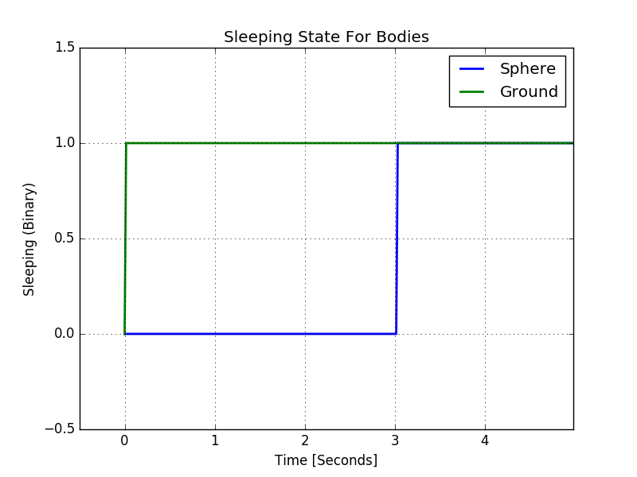

Ball Bouncing Off Surface
=========================

Purpose: create a plane and drop a ball onto it.

This simulation creates a 0.1m thin plane, and suspends a sphere 2m above it
(in y-direction). The set the mass of the plane to zero to make it static.

then we install a callback function to apply a force at each step. This make
the ball fall down.

.. note::
   We apply the force to *both* objects, ie the ball and ground. However, since
   we declared the ground *static* the force has no effect.

Here is the :download:`code <./tut_bouncing_ball.cpp>`:

.. literalinclude:: tut_bouncing_ball.cpp
    :linenos:
    :language: c

Linux
-----
To compile, link, and run the program type:

.. code-block:: bash
    :linenos:

    $ g++ tut_bouncing_ball.cpp -o tut_bouncing_ball -I ../../coreLibrary_300/source/newton/ -L ../../build/lib/ -lNewton -lpthread -Wl,"-rpath=../../build/lib/"
    $ ./tut_bouncing_ball

Other Platform
--------------
Please submit pull request for instructions.

Result
------

The left figure graphs the ``y`` position of both, the ball and ground plane.
As expected, the ball drops, bounces off the ground, and eventually comes to
rest. Note that the rest position is y=1.1m because the ball has a radius of
1m, and the ground is 0.1m thick.

The right figure shows the ``sleeping`` attribute for each body as returned by
``NewtonBodyGetSleepState``. Newton puts the static body immediately to rest
because it is, well, static. The ball, on the other hand, stays active until it
has come to rest on the surface.

Questions/Problems
------------------
